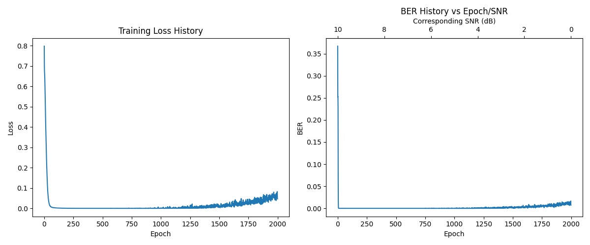
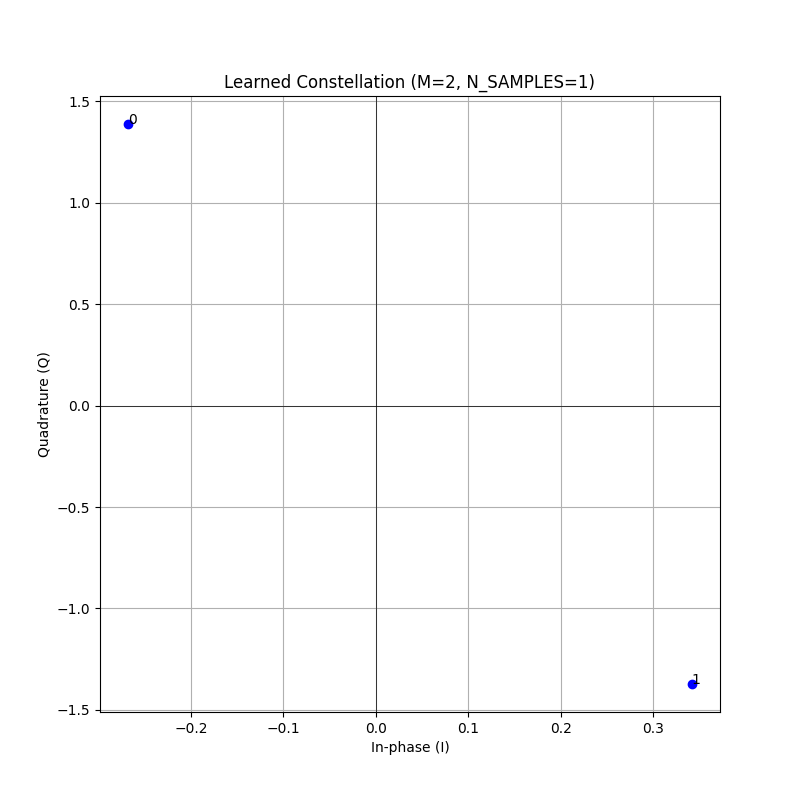
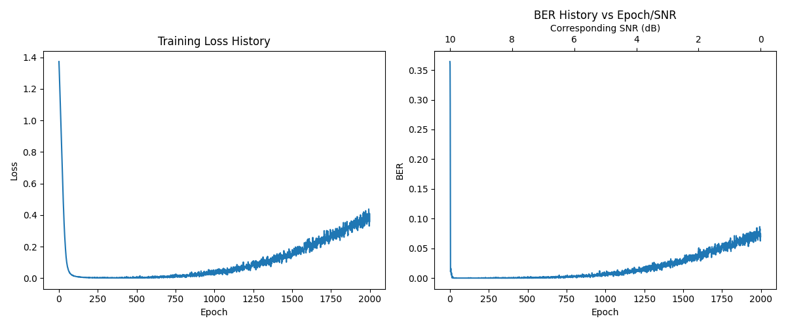
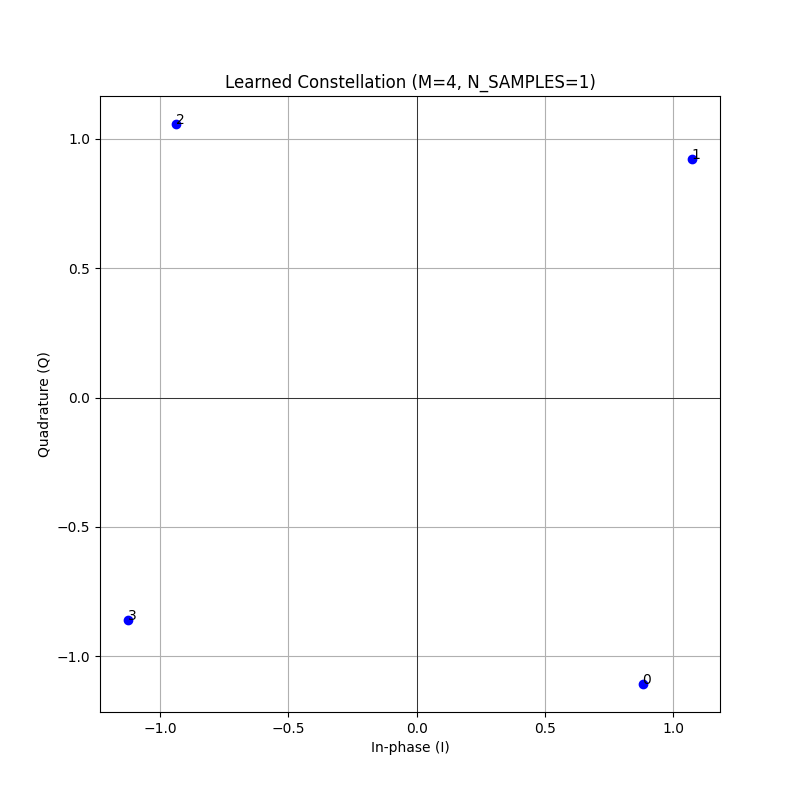
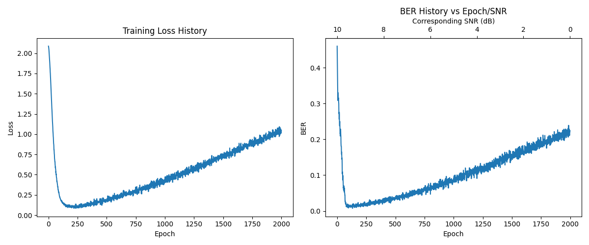
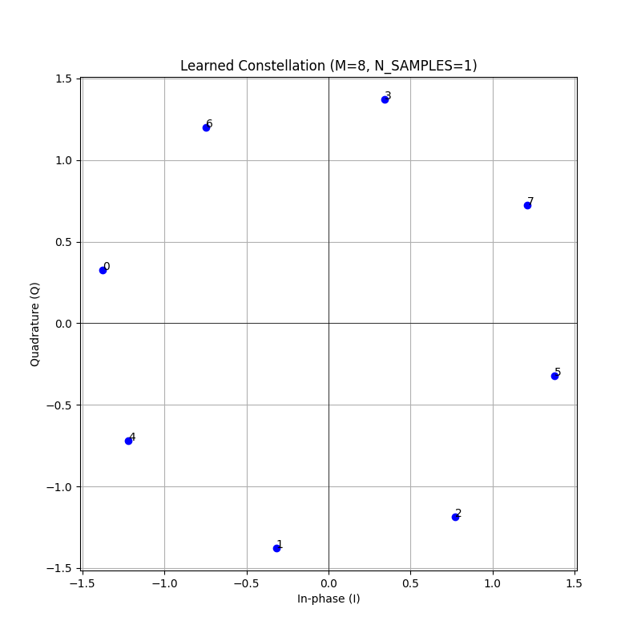
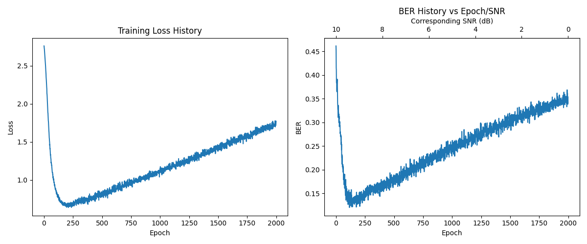
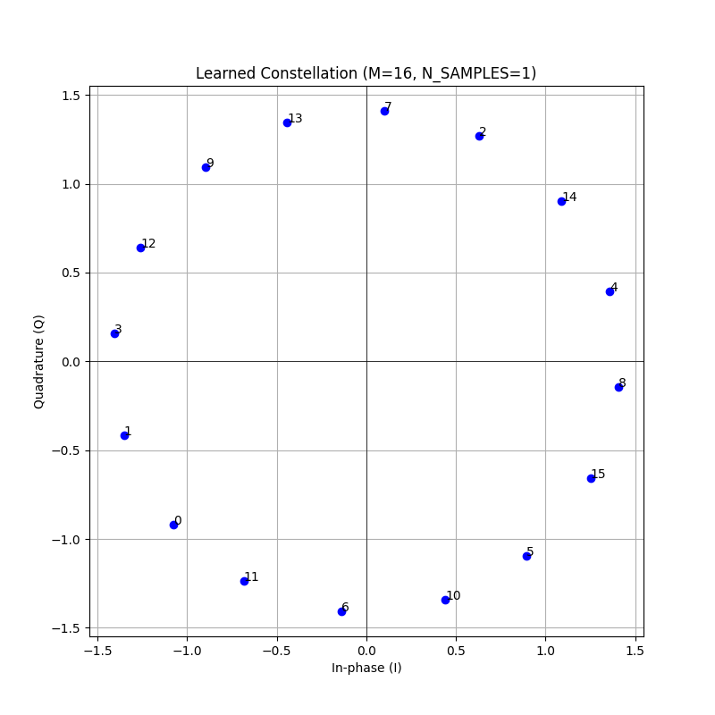

# Deep-HAM Radio PHY

Experimentation with Machine Learning (ML) techniques by developing novel Physical Layer (PHY) modulations using Deep Learning Autoencoders for Amateur Radio communication.

## Objective

The goal of this project is to discover non-traditional modulation schemes that move beyond standard FSK, LoRa, or BPSK. By treating the transmitter (Encoder) and receiver (Decoder) as a single differentiable neural network, we aim to "evolve" waveforms optimized for high robustness and sub-noise floor performance (negative SNR) on VHF/UHF bands. It is highly inspired by [RADE Radio Autoencoder](https://freedv.org/radio-autoencoder/).

## Architecture

The system implements an end-to-end differentiable DSP pipeline:

1.  **Input:** Message $M$ (One-hot encoded).
2.  **Encoder (TX):** Neural network mapping bits to complex I/Q samples.
3.  **Normalization:** Enforces average power constraints.
4.  **Channel:** Differentiable simulation of AWGN, phase noise, and frequency offsets (TBD).
5.  **Decoder (RX):** Neural network mapping noisy samples back to message probabilities.
6.  **Loss:** Categorical Cross-Entropy.

## Technical Stack

*   **Python 3.12+**
*   **PyTorch** (Differentiable DSP and GPU acceleration)
*   **uv** (Package management and CUDA environment handling)
*   **NumPy, Matplotlib** (Analysis and visualization)

---

## Experiments

This section documents the various attempts and iterations in discovering resilient waveforms.

### 1. Initial Constellation Learning (AWGN Only)

The first phase focuses on proving the model can learn classical constellations in pure noise across different message sizes and with positive or null SNRs.

And indeed the results show that the system is able to learn the usual constellations.
The constellation is not perfectly align on I/Q axis as it obviously does not matter for the learning process.

#### K=1 (2-ary, 1 bit per message)
*   **Samples per message (N):** 1
*   **SNR Curriculum:** 10dB $\to$ 0dB

#### 4-PSK K=2 (4-ary, 2 bits per message)
*   **Samples per message (N):** 1
*   **SNR Curriculum:** 10dB $\to$ 0dB

#### 8-PSK — K=3 (8-ary, 3 bits per message)
*   **Samples per message (N):** 1
*   **SNR Curriculum:** 10dB $\to$ 0dB

#### 16-PSK — K=4 (16-ary, 4 bits per message)
*   **Samples per message (N):** 1
*   **SNR Curriculum:** 10dB $\to$ 0dB

