# Deep-HAM Radio PHY

Experimentation with Machine Learning (ML) techniques by developing novel Physical Layer (PHY) modulations using Deep Learning Autoencoders for Amateur Radio communication.

## Objective

The goal of this project is to discover non-traditional modulation schemes that move beyond standard FSK, LoRa®, or BPSK. By treating the transmitter (Encoder) and receiver (Decoder) as a single differentiable neural network, we aim to "evolve" waveforms optimized for high robustness and sub-noise floor performance (negative SNR) on VHF/UHF bands. It is highly inspired by [RADE Radio Autoencoder](https://freedv.org/radio-autoencoder/).

The objective is for the autoencoder to achieve a BER of 0.1 ($10^{-1}$) at -15dB SNR, which would be considered a competitive protocol I guess.
Note that this depends also on the number of the number of bits per symbol ($K$, aka message) and the number of samples per symbol ($N$). This is know as the spreading factor in LoRa®.

## Architecture

The system implements an end-to-end differentiable DSP pipeline:

1.  **Input:** Message $M$ (One-hot encoded).
2.  **Encoder (TX):** Neural network mapping bits to complex I/Q samples.
3.  **Normalization:** Enforces average power constraints.
4.  **Channel:** Differentiable simulation of AWGN, phase noise, and frequency offsets (TBD).
5.  **Decoder (RX):** Neural network mapping noisy samples back to message probabilities.
6.  **Loss:** Categorical Cross-Entropy.

## Hypotheses and Choices

To ground the autoencoder in real-world Ham Radio physics, we make the following assumptions:

| Parameter | Default Value | Hypothesis / Choice |
| :--- | :--- | :--- |
| **Phase Noise** | $5.0^\circ$ | Represents the integrated phase jitter of a locked synthesizer in a 12.5 kHz narrowband FM channel. |
| **Freq Offset** | $0.05$ | Simulates a $\pm 1$ ppm TCXO drift (approx. $150$ Hz error at $144$ MHz/VHF) under a $12$ kHz sampling assumption. |
| **Latency ($N$)** | $16$ | Spreading factor for $K=4$. We assume a low-speed robust payload where bandwidth can be traded for sensitivity. |
| **SNR range** | $+10 \to -20$ dB | The goal is to discover modulations that remain decodable even when the signal is deep in the noise floor. |
- **PAPR (Peak-to-Average Power Ratio)**: Most Ham Radio power amplifiers are non-linear (Class-C). We optimize for low PAPR so the AI discovers signals that don't "splatter" when amplified.

## Technical Stack

*   **Python 3.12+**
*   **PyTorch** (Differentiable DSP and GPU acceleration)
*   **uv** (Package management and CUDA environment handling)
*   **NumPy, Matplotlib** (Analysis and visualization)

## Usage

You can run the simulation using `uv`:

```bash
uv run python main.py -K 4 -N 16 --snr-end -20
```

### Main Parameters:
- `-K`: Spreading Factor / Bits per message (default: 4)
- `-N`: Number of complex I/Q samples per message (default: 16)
- `--snr-start`: Training start SNR in dB (default: 10)
- `--snr-end`: Training target SNR in dB (default: -20)
- `--epochs`: Number of training iterations (default: 2000)
- `--bw-penalty`: Weight of the spectral penalty (default: 0.0)
- `--bw-limit`: Fraction of total bandwidth allowed (0.0-1.0, default: 0.5)
- `--fading-scale`: Strength of fading (0.0-1.0, default: 0.5).
- `--papr-penalty`: Weight of constant-envelope constraint (default: 1.0).
- `--max-offset`: Maximum random timing shift in samples (default: 0).
- `--no-gui`: Do not display plots, only save them to the `output/` directory (default: False).
- `--max-phase-deg`: Max phase noise in degrees (default: 5.0)
- `--max-freq-step`: Max frequency drift (default: 0.05)

---

## Experiments

This section documents the various attempts and iterations in discovering resilient waveforms.

### 1. Initial Constellation Learning (AWGN Only)

The first phase focuses on proving the model can learn classical constellations in pure noise across different message sizes and with positive or null SNRs.

And indeed the results show that the system is able to learn the usual constellations.
The constellation is not perfectly align on I/Q axis as it obviously does not matter for the learning process.

#### K=1 (2-ary, 1 bit per message)
*   **Samples per message (N):** 1
*   **SNR Curriculum:** 10dB $\to$ 0dB


#### 4-PSK K=2 (4-ary, 2 bits per message)
*   **Samples per message (N):** 1
*   **SNR Curriculum:** 10dB $\to$ 0dB


#### 8-PSK — K=3 (8-ary, 3 bits per message)
*   **Samples per message (N):** 1
*   **SNR Curriculum:** 10dB $\to$ 0dB


#### 16-PSK — K=4 (16-ary, 4 bits per message)
*   **Samples per message (N):** 1
*   **SNR Curriculum:** 10dB $\to$ 0dB


### 2. Redicosvering pulse-position modulation

The second phase focuses on discovering pulse-position modulation (PPM) waveforms that can resist multipath fading. Thus Rice fading is used to simulate multipath fading.

Also, to ensure the respect of a given bandwidth, a special penalty has been added based on used bandwidth.
- **Spectral Penalty**: FFT-based energy leakage detection for regulatory compliance.
- **PAPR Optimization**: Penalty for high Peak-to-Average Power Ratio to enable use of efficient non-linear Class-C amplifiers.

The results show that the system is able to rediscover pulse-position modulation.

```bash
uv run python main.py -K 4 -N 64 --fading-scale 0.9 --n-taps 5 --epochs 3000 --bw-penalty 2.0
```

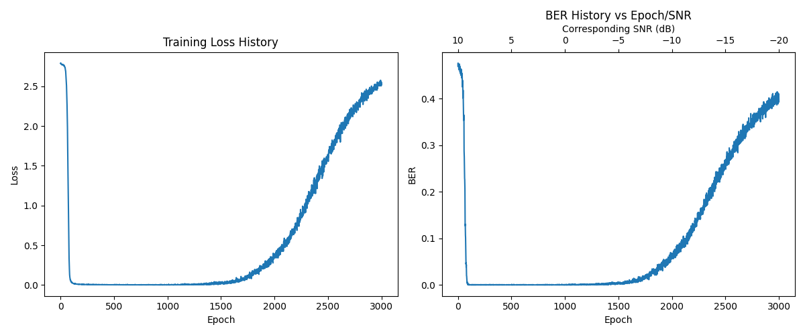
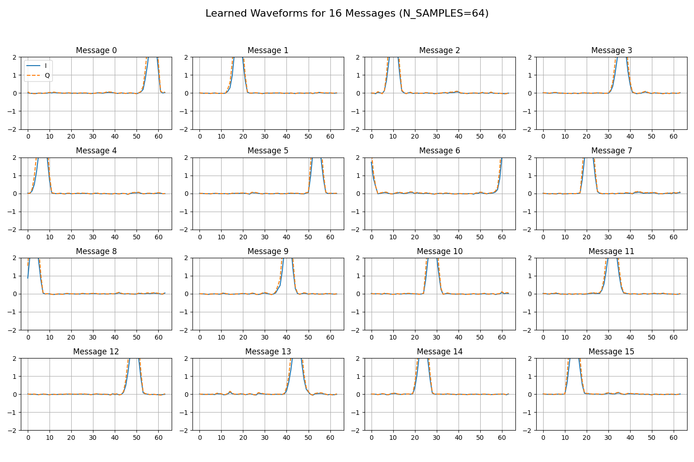
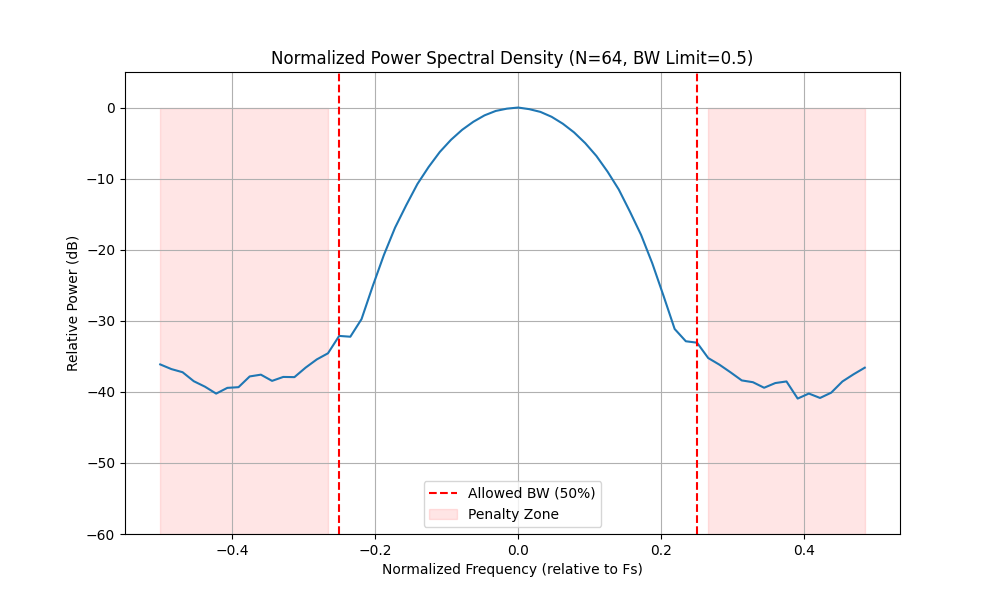


### 3. Adding Peak-to-Average Power Ratio (PAPR) penalty

As we do not want to cheat on available power, a PAPR penalty has been added.
The PAPR has forced the system to spread-out the system over time.
Also the fading penalty has forced the system to come up with several pulse.
With that, I learned a new modulation scheme that I did not know before (but seems to be well-known by the number of journals' articles): Multi-Pulse Position Modulation (MPPM)!

```bash
uv run python main.py -K 4 -N 64 --fading-scale 0.9 --n-taps 5 --epochs 3000 --bw-penalty 2.0 --papr-penalty 1.0
```

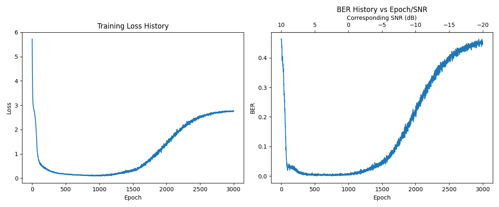
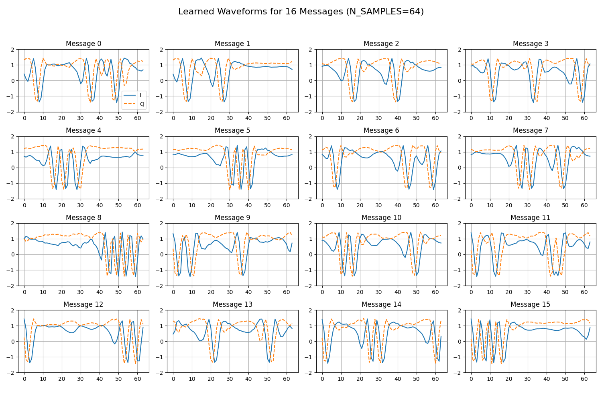
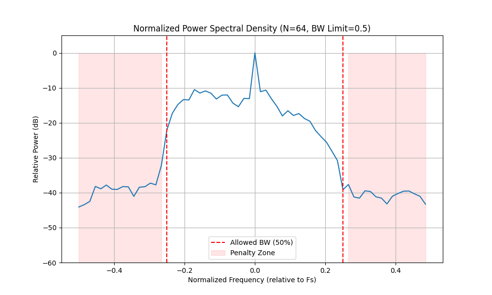
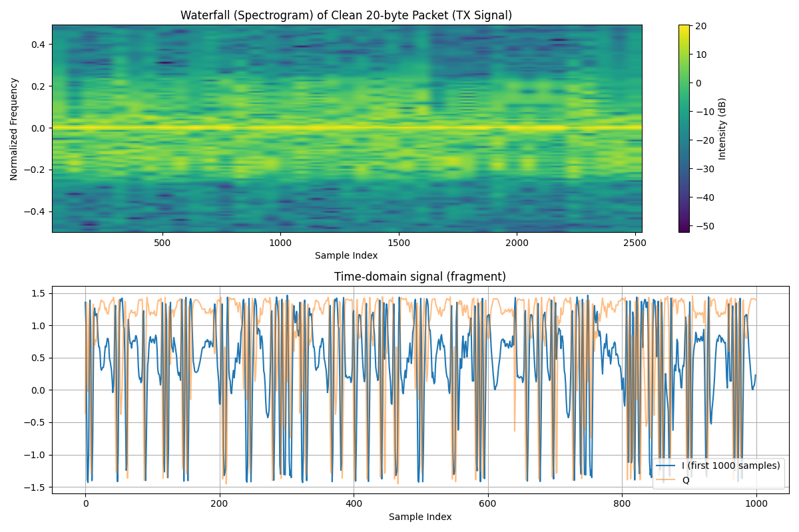

### 4. Adding timing offset

The receiver may not be synchronized with the transmitter, thus a random timing offset has been added. The internal of the machine learning has been reviewed so as to better suit a timing invariant.

The final PAPR is 0.08 dB, meaning the power envelope is pretty constant (which is a good thing). The waveform is much more creative, yet the BER is still not acceptable. Probably the spreading factor, ie $N/K$ (well [more or less...](https://medium.com/@prajzler/what-is-lora-the-fundamentals-79a5bb3e6dec)) is too small.

```bash
uv run python main.py -K 4 -N 64 --fading-scale 0.9 --n-taps 5 --epochs 3000 --bw-penalty 2.0 --papr-penalty 1.0 --max-offset 64 --prefix timing_offset_1
```

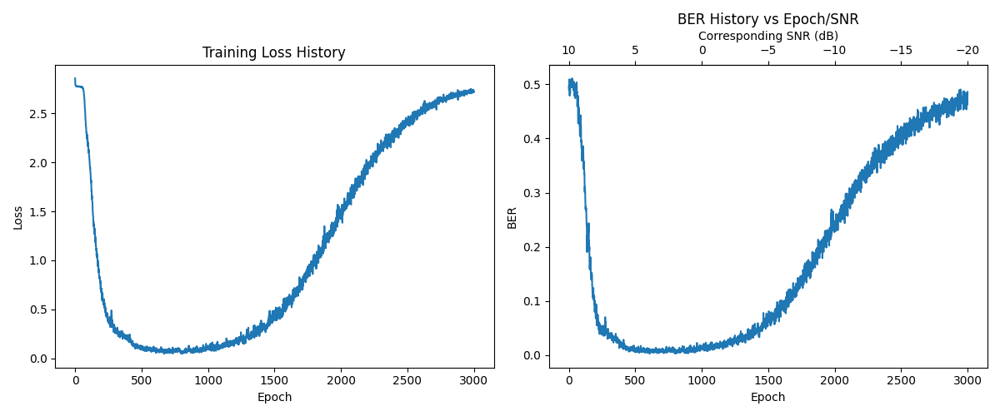
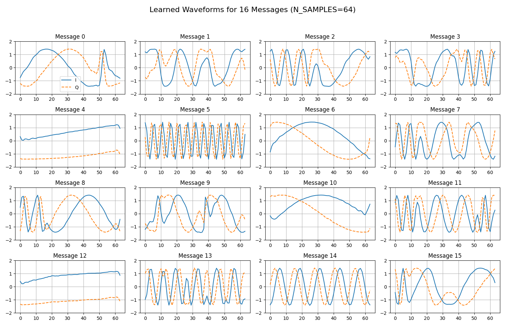

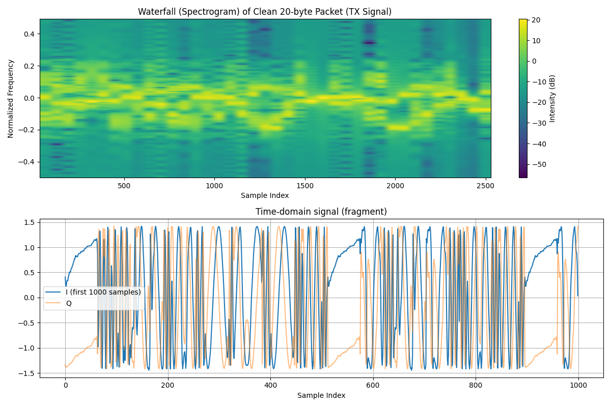

### 5. Simple effective modulation

Eventually, the system has rediscovered a simple effective modulation scheme. The internal of the machine learning has been reviewed so as to better suit a timing invariant. I must confess that at this stage, I did not grasp all the changes made due to all the layering modified/added (GRU, STN, etc). The radio part was much easier to get. Note that I also reach some memory limit for the system to run on my Nvidia Geforce GTX 970 with a total capacity of 3.94GiB but of only which 1.32GiB is free.

Yet, if we give to the system some constraints similar to the one of LoRa®, ie bigger spreadfactor and large bandwidth, the system is able to rediscover a waveform that is quite effective with a final BER at -15.00dB of 0.158984 under heavy fading and timing offsets. The PAPR is 0.67 dB.

Note that I cannot reproduce exact same constraints that could lead to LoRa® on my machine as it would require $N \in [512..1024] $ and $K \in [7..12]$. Maybe I will try on another machine or if someone want to reproduce?

```bash
uv run python main.py   -K 2 -N 128   --epochs 3000   --max-offset 64   --fading-scale 0.9 --n-taps 3   --bw-penalty 1.5 --bw-limit 1.0   --papr-penalty 2.0   --rolloff 0.35   --batch-size 128  --snr-start 10 --snr-end -15   --prefix lora_like_discovery_2
```


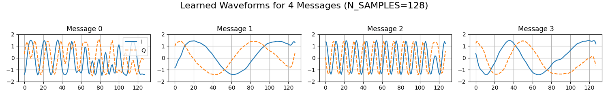
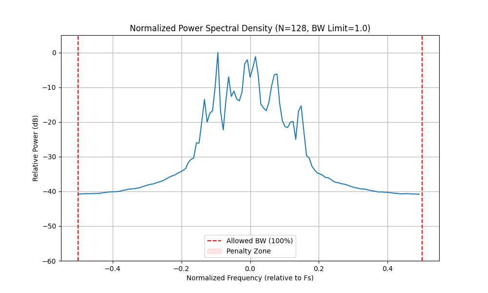
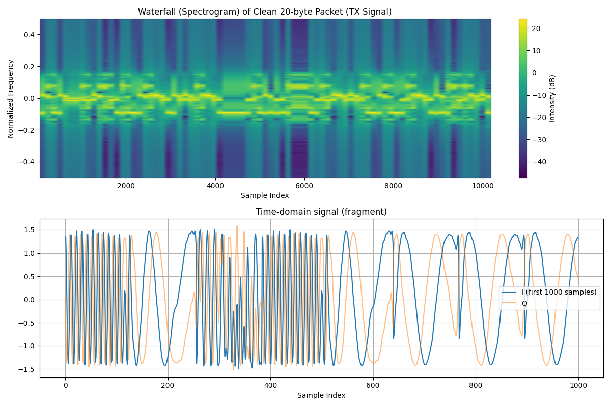

I am pretty happy with this simple result as it perform quite well. I observe that there is no chirp but I see some changes in the phase so I guess this is how the timing synchronization is done. I would like some greater experts (I am a noob) than me to review the system to confirm this radio aspect but also to better understand the internal of the machine learning.

From a machine learning perspective, I also discover that starting with a too good snr (`--snr-start`) leads to really bad results. Indeed it locks the result too early, while starting lower like in this case, the model probably prioritize energy per bits or other.

## Machine Learning Detailed Architecture

Treating the transmitter and receiver as a single neural network allows the system to discover optimal ways to represent information in the presence of noise and distortion. Below is the breakdown of the current architecture.

### Conceptual Mapping: ML vs. Radio Engineering

| AI Layer | Functional Role in Radio Terms |
| :--- | :--- |
| **Encoder (Transmitter)** | **Symbol Mapping & Waveform Generation**. Maps bit-indices to high-dimensional I/Q sample sequences. |
| **STN (Spatial Transformer)** | **AGC + Coarse Sync**. Scans the search window and "crops" out the signal, centering it for the receiver. |
| **CNN Layers** | **Matched Filtering & Feature Extraction**. Detects specific sub-patterns (chips/phases) in the I/Q stream. |
| **GRU (Bidirectional)** | **Sequence Memory**. Analyzes temporal history to handle multipath fading and synchronization errors. |
| **Attention Pooling** | **Soft-Gate Synchronization**. Assigns weights to samples to prioritize signal over non-signal (noise) areas. |

### Visual Graph

The flow of data through the Encoder and Decoder can be visualized using the `--draw-graph` command.

#### Encoder (Transmitter)
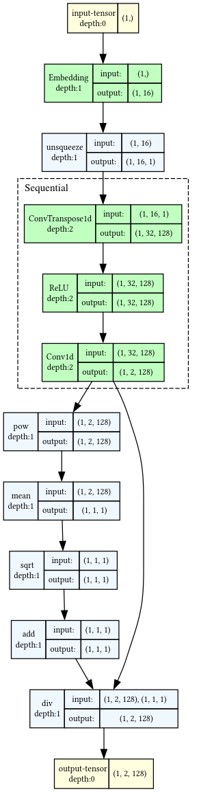

#### Decoder (Receiver)
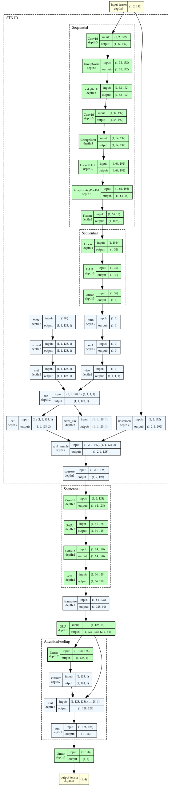

### Regenerating Diagrams
You can regenerate these diagrams locally if you have `graphviz` installed on your system:
```bash
uv run python main.py --draw-graph
```