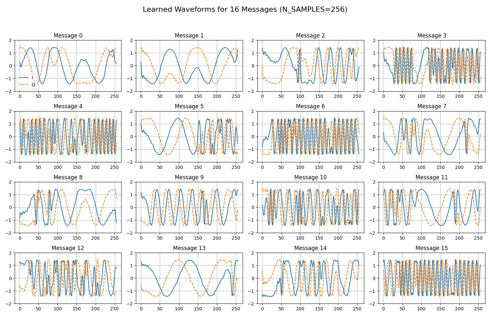
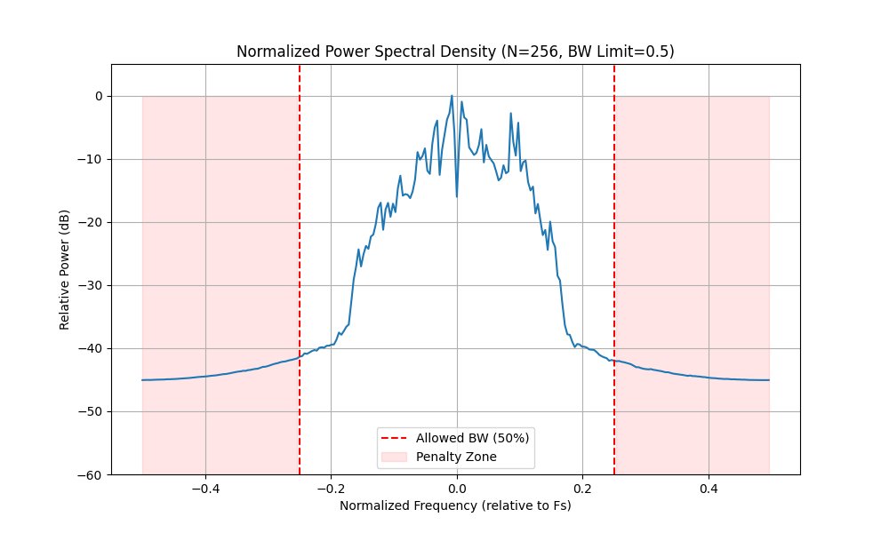
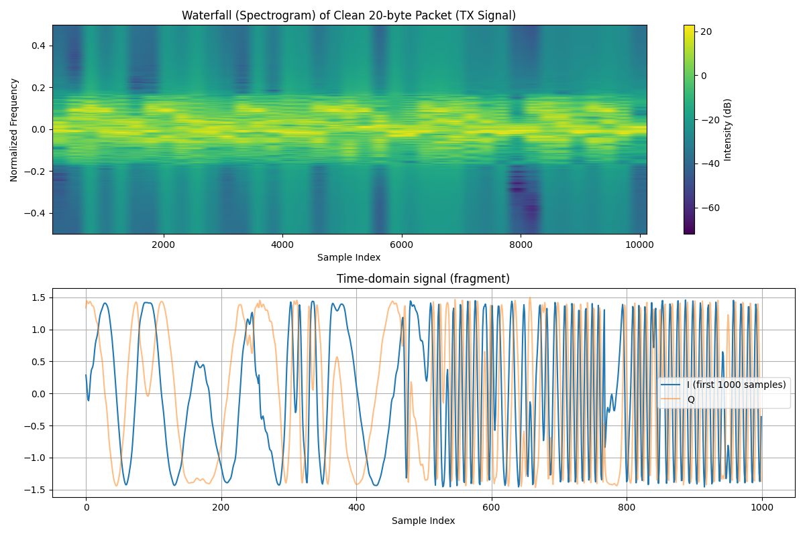
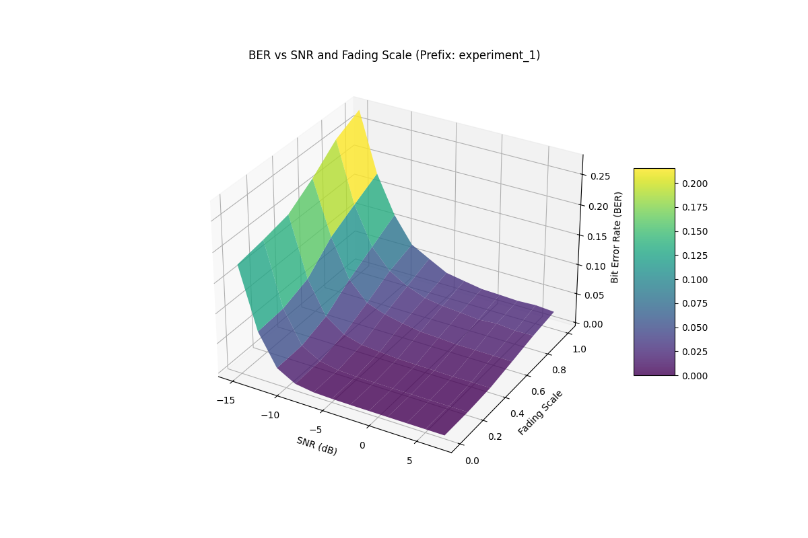

# Evaluation Report: experiment_1

## Training Parameters
- **K (Bits per Message)**: 4 (M=16)
- **N (IQ Samples)**: 256
- **Max Timing Offset**: 64
- **RRC Roll-off**: 0.33
- **RRC Filter Span**: 8
- **Multipath Taps**: 3
- **Phase Ambiguity**: 5.0°
- **Freq Drift Step**: 0.05

## Training Artifacts

## Persistence & Deployment
- Encoder Model: [encoder.pth](experiment_1_encoder.pth)
- Decoder Model: [decoder.pth](experiment_1_decoder.pth)
- SigMF Data: [sigmf-data](experiment_1_learned_waveforms.sigmf-data)
- SigMF Meta: [sigmf-meta](experiment_1_learned_waveforms.sigmf-meta)

## 3D BER Analysis
This plot shows the BER performance across both Signal-to-Noise Ratio (SNR) and Fading Scale (multipath intensity).

### BER Data Table
| Fading \ SNR | 7.0 | 5.0 | 3.0 | 1.0 | -1.0 | -3.0 | -5.0 | -7.0 | -9.0 | -11.0 | -13.0 | -15.0 |
|---|---|---|---|---|---|---|---|---|---|---|---|---|
| 0.0 | 0.0000 | 0.0000 | 0.0000 | 0.0000 | 0.0001 | 0.0001 | 0.0004 | 0.0014 | 0.0058 | 0.0228 | 0.0744 | 0.1758 |
| 0.2 | 0.0000 | 0.0000 | 0.0000 | 0.0000 | 0.0000 | 0.0000 | 0.0003 | 0.0016 | 0.0074 | 0.0244 | 0.0781 | 0.1832 |
| 0.4 | 0.0026 | 0.0028 | 0.0021 | 0.0027 | 0.0031 | 0.0037 | 0.0059 | 0.0084 | 0.0171 | 0.0386 | 0.0937 | 0.1927 |
| 0.6 | 0.0103 | 0.0106 | 0.0108 | 0.0106 | 0.0128 | 0.0141 | 0.0190 | 0.0256 | 0.0362 | 0.0675 | 0.1314 | 0.2211 |
| 0.8 | 0.0184 | 0.0176 | 0.0206 | 0.0182 | 0.0211 | 0.0236 | 0.0283 | 0.0397 | 0.0573 | 0.0906 | 0.1544 | 0.2556 |
| 1.0 | 0.0241 | 0.0264 | 0.0250 | 0.0264 | 0.0275 | 0.0327 | 0.0381 | 0.0539 | 0.0703 | 0.1132 | 0.1762 | 0.2759 |
