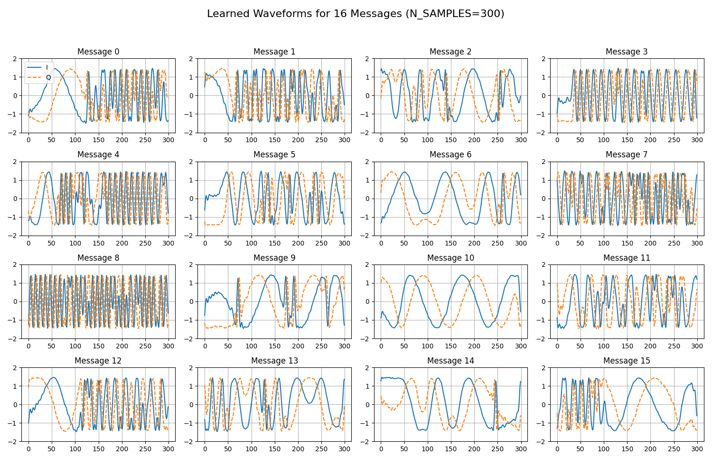
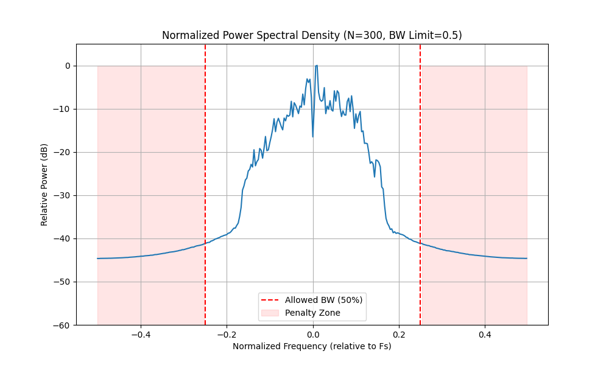
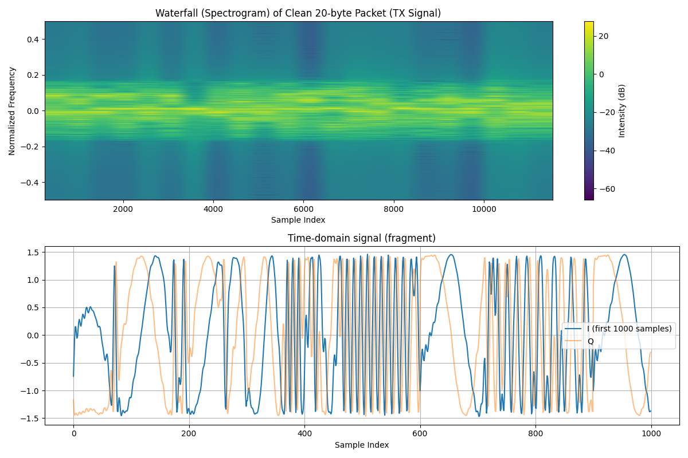

# Evaluation Report: experiment_2

## Training Parameters
- **K (Bits per Message)**: 4 (M=16)
- **N (IQ Samples)**: 300
- **Max Timing Offset**: 64
- **RRC Roll-off**: 0.33
- **RRC Filter Span**: 8
- **Multipath Taps**: 3
- **Phase Ambiguity**: 5.0°
- **Freq Drift Step**: 0.05

## Training Artifacts

## Persistence & Deployment
- Encoder Model: [encoder.pth](experiment_2_encoder.pth)
- Decoder Model: [decoder.pth](experiment_2_decoder.pth)
- SigMF Data: [sigmf-data](experiment_2_learned_waveforms.sigmf-data)
- SigMF Meta: [sigmf-meta](experiment_2_learned_waveforms.sigmf-meta)

## 3D BER Analysis
This plot shows the BER performance across both Signal-to-Noise Ratio (SNR) and Fading Scale (multipath intensity).

### BER Data Table
| Fading \ SNR | 7.0 | 5.0 | 3.0 | 1.0 | -1.0 | -3.0 | -5.0 | -7.0 | -9.0 | -11.0 | -13.0 | -15.0 |
|---|---|---|---|---|---|---|---|---|---|---|---|---|
| 0.0 | 0.0007 | 0.0008 | 0.0005 | 0.0006 | 0.0006 | 0.0008 | 0.0014 | 0.0015 | 0.0039 | 0.0140 | 0.0570 | 0.1585 |
| 0.2 | 0.0007 | 0.0007 | 0.0008 | 0.0009 | 0.0005 | 0.0011 | 0.0013 | 0.0018 | 0.0042 | 0.0154 | 0.0595 | 0.1585 |
| 0.4 | 0.0035 | 0.0035 | 0.0032 | 0.0039 | 0.0034 | 0.0035 | 0.0056 | 0.0066 | 0.0129 | 0.0286 | 0.0789 | 0.1790 |
| 0.6 | 0.0117 | 0.0130 | 0.0150 | 0.0140 | 0.0156 | 0.0177 | 0.0195 | 0.0248 | 0.0321 | 0.0569 | 0.1100 | 0.2054 |
| 0.8 | 0.0251 | 0.0262 | 0.0252 | 0.0295 | 0.0285 | 0.0283 | 0.0321 | 0.0378 | 0.0502 | 0.0823 | 0.1395 | 0.2306 |
| 1.0 | 0.0354 | 0.0329 | 0.0339 | 0.0376 | 0.0366 | 0.0394 | 0.0424 | 0.0502 | 0.0657 | 0.0954 | 0.1531 | 0.2465 |
